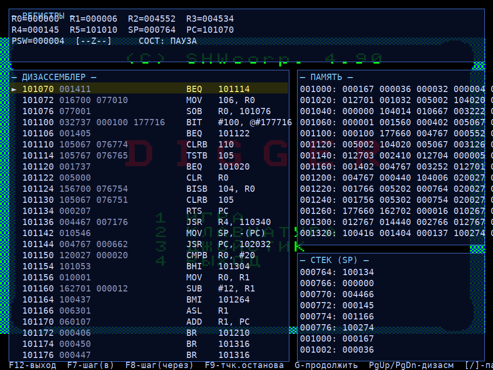

# Эмулятор-отладчик БК-0010-01

Эмулятор советского персонального компьютера **БК-0010-01** (процессор К1801ВМ1,
клон PDP-11) на **C++17 / Qt6 / OpenGL** с отладчиком в стиле **Soft-ICE**.



## Возможности

- **Процессор К1801ВМ1** — полный набор инструкций PDP-11 (+ SOB, XOR), точный
  расчёт флагов N/Z/V/C, все 8 режимов адресации, прерывания и векторы.
- **Экран** через OpenGL (`QOpenGLWidget`): режимы **256×256 (4 цвета)** и
  **512×256 (ч/б)**, палитры БК-0010, вертикальный скролл. Переключение — `F10`.
- **Загрузка и исполнение `.BIN`** (игр) с автозагрузкой ПЗУ-монитора.
- **Клавиатура БК-0010**: когда отладчик выключен, ввод с клавиатуры хоста идёт в
  БК (коды КОИ-7). Латиница/цифры/пунктуация, кириллица (КОИ-7 Н1), спец-клавиши
  (стрелки, ВВОД, ЗАБ, ВС, СБР, функциональные), СУ(Ctrl)+буква → управляющий код;
  РУС/ЛАТ переключается автоматически при смене языка ввода, а также вручную
  клавишами **левый Shift (РУС)** и **правый Shift (ЛАТ)** — их же игры часто
  используют как «выстрел влево/вправо» (Shift, а не Ctrl, чтобы не мешать
  Ctrl-шорткатам приложения). **50 Гц прерывание**
  (вектор 0100) и прерывание клавиатуры (векторы 060 / 0274).
- **Звук пищалки** — генерация сэмплов в ядре (`Speaker`) с воспроизведением через
  `QAudioSink` (при наличии Qt6 Multimedia). Отключение звука — `Ctrl+M`.
- **Отладчик Soft-ICE** (`F12`) — полупрозрачный оверлей поверх экрана БК:
  регистры/PSW, дизассемблер с подсветкой PC и точками останова, дамп памяти, стек.
  Пошаговая отладка с одновременным показом экрана БК.
- **Визуализация памяти** — графический вид памяти 1/4/8 бит на пиксель, ч/б и цвет,
  с **тепловой картой** обращений: давно не используемая память показывает своё
  содержимое ярко, а свежий доступ вспыхивает цветом и плавно затухает — **чтение
  зелёным, запись красным, исполнение кода синим**. По умолчанию во всё окно
  показывается только ОЗУ; флажок «Показать ПЗУ» добавляет ПЗУ (весь адресный
  диапазон в более мелком масштабе).
- **Граф кода и горячие точки** — граф потока управления (исполненные инструкции
  как узлы, переходы как дуги) и список самых «горячих» инструкций. Граф можно
  **скроллировать** (колесо / перетаскивание / стрелки) и **масштабировать**
  (Ctrl+колесо или `+`/`−`, сброс — `Home`).
- **Сохранение/восстановление** полного состояния (`Ctrl+S` / `Ctrl+L`).

## Сборка

Требуется CMake ≥ 3.16, компилятор C++17, Qt6 (Core, Gui, Widgets, OpenGLWidgets).
Опционально Qt6 Multimedia для звука (`qt6-qtmultimedia-devel`).

```sh
cmake -S . -B build -DCMAKE_BUILD_TYPE=Release
cmake --build build -j
```

## Запуск

```sh
./build/bk0010-emulator [путь/к/игре.bin]
```

ПЗУ (`monit10.rom`, `basic10.rom`) ищутся в каталоге `roms/` (задаётся при сборке,
переопределяется `--roms <dir>` или переменной `BK_ROM_DIR`).

### Горячие клавиши

| Клавиша | Действие                                   |
|---------|--------------------------------------------|
| `F12`   | Включить/выключить отладчик Soft-ICE       |
| `F7`    | Шаг с заходом (step into)                  |
| `F8`    | Шаг с обходом (step over)                  |
| `F9`    | Точка останова на текущем PC               |
| `G`     | Продолжить выполнение                      |
| `F10`   | Переключить режим экрана (цвет ↔ ч/б)       |
| `Ctrl+R`| Сброс                                       |
| `Ctrl+M`| Включить/выключить звук                     |
| `Ctrl+G`| Граф кода / горячие точки                   |
| `Ctrl+I`| Визуализация памяти                         |
| `Ctrl+S`/`Ctrl+L` | Сохранить / восстановить состояние |

Меню **Отладка** (и клавиши `Ctrl+G` / `Ctrl+I`) открывает окна графа кода и
визуализации памяти.

## Тесты

```sh
ctest --test-dir build          # или ./build/cpu_tests
```

Юнит-тесты покрывают декодер инструкций, флаги, ветвления, JSR/RTS, SOB и
сохранение/восстановление состояния.

## Безголовый режим (для проверки/скриншотов)

```sh
QT_QPA_PLATFORM=offscreen ./build/bk0010-emulator --frames 200 --shot out.png game.bin
```

Доступны: `--frames N`, `--shot`, `--dbgshot`, `--memvis`, `--codegraph`,
`--mono`, `--key <код>`, `--keyframe N`.

## MCP-сервер (отладка через Claude)

Эмулятор умеет работать как MCP-сервер (Model Context Protocol) — тогда Claude
может загружать `.BIN`, шагать по коду, читать/писать память и регистры, ставить
точки останова, снимать скриншоты и смотреть «горячие» инструкции сам.

```sh
./build/bk0010-emulator --server        # JSON-RPC 2.0 по stdio (по строкам)
```

Регистрация в Claude Code — файл [`.mcp.json`](.mcp.json) в корне проекта уже
готов (сервер `bk0010`). После сборки запустите Claude Code из этого каталога и
подтвердите подключение сервера.

Инструменты (все адреса/значения принимают десятичное, `0x…` hex или восьмеричное
с ведущим `0` — по соглашению БК):

| Инструмент | Назначение |
|------------|-----------|
| `bk_load` | загрузить `.BIN` (сначала грузится монитор) и запустить |
| `bk_reset` | сброс машины |
| `bk_run` / `bk_run_until` | выполнять кадры / до адреса-символа |
| `bk_step` / `bk_step_over` | шаг внутрь / через JSR·EMT |
| `bk_regs` / `bk_set_reg` | чтение / запись R0–R7, SP, PC, PSW |
| `bk_read_mem` / `bk_write_mem` | память словами или байтами |
| `bk_disasm` | дизассемблирование |
| `bk_break` / `bk_unbreak` / `bk_breakpoints` | точки останова |
| `bk_key` | послать код клавиши (КОИ-7) |
| `bk_screenshot` | PNG экрана БК |
| `bk_state_save` / `bk_state_load` | сохранить / восстановить состояние |
| `bk_symbols` | загрузить символы из `.map` (GNU ld) — адреса по имени |
| `bk_hotspots` | самые часто исполняемые инструкции |

## Архитектура

- `src/core/` — ядро эмуляции (без Qt): `Cpu`, `Memory`, `Disasm`, `Screen`,
  `Speaker`, `Trace`, `Board` (главный цикл, I/O-регистры, прерывания, save/restore).
- `src/ui/` — Qt6: `MainWindow`, `GlScreen` (OpenGL), `DebuggerOverlay`,
  `MemVisWidget`, `CodeGraphWidget`.
- `src/mcp/` — `McpServer`: MCP-сервер поверх ядра (JSON-RPC по stdio, QtCore JSON).

Ядро исполняет инструкции по кадрам 50 Гц (3 МГц), UI-поток отображает текстуру
экрана и панели отладчика.

Справочник по железу БК-0010-01 (карта памяти, регистры, векторы, кодирование
экрана, палитра, формат `.BIN`, тактирование) — в [`docs/BK0010-hardware.md`](docs/BK0010-hardware.md).
Указания для будущих сессий Claude Code — в [`CLAUDE.md`](CLAUDE.md).
