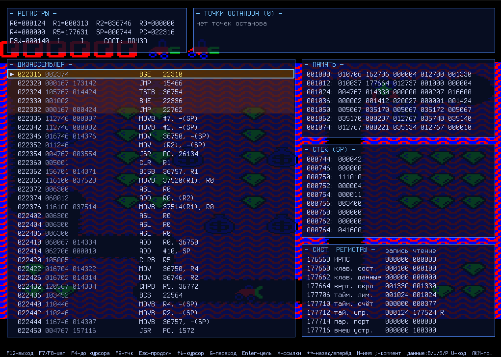

# Эмулятор-отладчик БК-0010-01

Эмулятор советского персонального компьютера **БК-0010-01** (процессор К1801ВМ1,
клон PDP-11) на **C++17 / Qt6 / OpenGL** с отладчиком в стиле **Soft-ICE**.



## Возможности

- **Процессор К1801ВМ1** — полный набор инструкций PDP-11 (+ SOB, XOR), точный
  расчёт флагов N/Z/V/C, все 8 режимов адресации, прерывания и векторы.
- **Экран** через OpenGL (`QOpenGLWidget`): режимы **256×256 (4 цвета)** и
  **512×256 (ч/б)**, палитры БК-0010, вертикальный скролл. Переключение — `F10`.
- **Загрузка и исполнение `.BIN`** (игр) с автозагрузкой ПЗУ-монитора.
- **Клавиатура БК-0010**: когда отладчик выключен, ввод с клавиатуры хоста идёт в
  БК (коды КОИ-7). Латиница/цифры/пунктуация, кириллица (КОИ-7 Н1), спец-клавиши
  (стрелки, ВВОД, ЗАБ, ВС, СБР, функциональные), СУ(Ctrl)+буква → управляющий код;
  РУС/ЛАТ переключается автоматически при смене языка ввода, а также вручную
  клавишами **левый Shift (РУС)** и **правый Shift (ЛАТ)** — их же игры часто
  используют как «выстрел влево/вправо» (Shift, а не Ctrl, чтобы не мешать
  Ctrl-шорткатам приложения). **кадровое прерывание**
  (вектор 0100) и прерывание клавиатуры (векторы 060 / 0274).
- **Звук пищалки** — генерация сэмплов в ядре (`Speaker`) с воспроизведением через
  `QAudioSink` (при наличии Qt6 Multimedia). Отключение звука — `Ctrl+M`.
- **Отладчик Soft-ICE** (`F12`) — полупрозрачный оверлей поверх экрана БК:
  регистры/PSW, дизассемблер с подсветкой PC и точками останова, дамп памяти, стек.
  Пошаговая отладка с одновременным показом экрана БК.
- **Визуализация памяти** — графический вид памяти 1/2/4/8/16 бит на пиксель, ч/б и цвет
  (по умолчанию «2 бита» — палитра БК: экранное ОЗУ выглядит как сама картинка),
  с **тепловой картой** обращений: давно не используемая память показывает своё
  содержимое ярко, а свежий доступ вспыхивает цветом и плавно затухает — **чтение
  зелёным, запись красным, исполнение кода синим**. По умолчанию во всё окно
  показывается только ОЗУ; флажок «Показать ПЗУ» добавляет ПЗУ (весь адресный
  диапазон в более мелком масштабе).
- **Горячий путь** — самые исполняемые **цепочки базовых блоков** (пути),
  связанные наиболее частыми переходами, отсортированные по доле времени CPU
  (топ-N). Каждый путь свёрнут в строку-сводку (ранг, вход, число блоков, %,
  тепловая полоса); **левый клик** по треугольнику `▸` разворачивает путь в его
  **блоки** (с переходами `→ адрес`), а блок — в **ассемблерные инструкции** со
  счётчиками исполнений. Клик по телу строки ведёт дизассемблер на адрес.
  **Правый клик** скрывает адрес (напр. цикл-пустышку), `0` — показать всё,
  `+`/`−` — число путей. Прокрутка — колесо / перетаскивание. Строки подкрашены
  по «температуре» (частоте исполнения).
- **Пламенный граф** (`Ctrl+F`) — flame graph по восстановленному **дереву вызовов**:
  каждый прямоугольник — кадр стека, ширина ∝ времени CPU (inclusive), вниз =
  глубже по стеку (корень/`main` вверху). Стек восстанавливается на лету по
  `JSR`/возвратам (и прерываниям). **Клик** — углубиться в поддерево, **ПКМ**/
  `Backspace` — вверх, `0` — весь граф, `Del` — сброс; клик ведёт дизассемблер
  на подпрограмму, наведение показывает собств./вкл. долю.
- **Хронология вызовов** (`Ctrl+T`) — времяупорядоченный flame chart (как в
  Chrome DevTools/speedscope): X = время CPU, Y = глубина стека, каждый бар — один
  вызов подпрограммы на всём протяжении, пока он был на стеке. Правый край — «сейчас».
  Колесо — зум времени, тащить — прокрутка по глубине, клик — в дизассемблер.
- Все окна профилировщика связаны **общей подсветкой** (наведение на подпрограмму
  подсвечивает её во всех окнах и в дизассемблере). У «Горячих инструкций во времени»
  дополнительно: `G` — агрегация по подпрограммам, `S` — стопка (streamgraph),
  `F` — маркеры кадров по таймеру, колесо над графиком — зум по времени.
- **Сохранение/восстановление** полного состояния (`Ctrl+S` / `Ctrl+L`).

## Сборка

Требуется CMake ≥ 3.16, компилятор C++17, Qt6 (Core, Gui, Widgets, OpenGLWidgets).
Опционально Qt6 Multimedia для звука (`qt6-qtmultimedia-devel`).

```sh
cmake -S . -B build -DCMAKE_BUILD_TYPE=Release
cmake --build build -j
```

## Запуск

```sh
./build/bk0010-emulator [путь/к/игре.bin]
```

ПЗУ (`monit10.rom`, `basic10.rom`) ищутся в каталоге `roms/` (задаётся при сборке,
переопределяется `--roms <dir>` или переменной `BK_ROM_DIR`).

### Блок расширения памяти СМК-512

Опционально эмулируется контроллер **СМК-512** («АльтПро») в разъёме МПИ —
512 Кбайт дополнительного ОЗУ: 16 страниц по 32 Кбайт, восемь режимов подключения,
регистр управления `0177130`. По умолчанию плата **не установлена**. Включается в
меню «Эмуляция» (настройка запоминается между запусками) или ключом `--smk`;
`--no-smk` выключает. С установленной платой отладчик показывает текущий режим и
номер страницы в панели «СИСТ. РЕГИСТРЫ», по Ctrl+D открывается дамп всех 512 Кбайт
ДОЗУ постранично (с адресом БК, по которому строка видна сейчас), а в визуализаторе
памяти появляется выбор источника — память БК, все 16 страниц ДОЗУ или одна.
Дисковод, винчестер и ПЗУ самого контроллера не эмулируются — что из этого следует,
разобрано в [docs/smk512.md](docs/smk512.md).

Потактовая эмуляция арбитража видеоконтроллера **КР1801ВП1-037** (такты ожидания при
доступе к ОЗУ во время активной развёртки) включена **по умолчанию**; ключ
`--no-arb037` возвращает прежнюю «идеальную» память. Подробности — в
`docs/BK0010-hardware.md`.

### Горячие клавиши

| Клавиша | Действие                                   |
|---------|--------------------------------------------|
| `Esc`   | Клавиша **СТОП** БК (прерывание по вектору 4); в отладчике — продолжить |
| `F12`   | Включить/выключить отладчик Soft-ICE       |
| `F7`    | Шаг с заходом (step into)                  |
| `F8`    | Шаг с обходом (step over)                  |
| `F9`    | Точка останова на текущем PC               |
| `G`     | Продолжить выполнение                      |
| `F10`   | Переключить режим экрана (цвет ↔ ч/б)       |
| `Ctrl+R`| Сброс                                       |
| `Ctrl+M`| Включить/выключить звук                     |
| `Ctrl+G`| Горячий путь                                |
| `Ctrl+K`| Граф вызовов                                |
| `Ctrl+F`| Пламенный граф                              |
| `Ctrl+T`| Хронология вызовов (flame chart)            |
| `Ctrl+H`| Горячие инструкции во времени               |
| `Ctrl+I`| Визуализация памяти                         |
| `Ctrl+D`| ДОЗУ СМК-512 по страницам                   |
| `Ctrl+S`/`Ctrl+L` | Сохранить / восстановить состояние |

Меню **Отладка** открывает окна профилировщика (горячий путь, граф вызовов,
пламенный граф, горячие во времени), визуализации памяти и дампа ДОЗУ СМК-512.

## Тесты

```sh
ctest --test-dir build          # или ./build/cpu_tests
```

Юнит-тесты покрывают декодер инструкций, флаги, ветвления, JSR/RTS, SOB и
сохранение/восстановление состояния.

## Безголовый режим (для проверки/скриншотов)

```sh
QT_QPA_PLATFORM=offscreen ./build/bk0010-emulator --frames 200 --shot out.png game.bin
```

Доступны: `--frames N`, `--shot`, `--dbgshot`, `--memvis`, `--hotpath`,
`--callgraph`, `--flame`, `--flamechart`, `--hotchart`, `--mono`, `--no-arb037`,
`--scanline`, `--smk` / `--no-smk`, `--key <код>`, `--keyframe N`.

`--scanline` включает **построчную отрисовку**: каждая строка рисуется тем значением
регистра смещения `0177664`, какое стояло, когда луч её проходил (по модели развёртки
`Vp037`). Нужно для построчных эффектов — параллакса и «разрезанного» экрана; при
покадровой отрисовке (по умолчанию) весь кадр рисуется последним значением скролла.

## MCP-сервер (отладка через Claude)

Эмулятор умеет работать как MCP-сервер (Model Context Protocol) — тогда Claude
может загружать `.BIN`, шагать по коду, читать/писать память и регистры, ставить
точки останова, снимать скриншоты и смотреть «горячие» инструкции сам. Для
**отладки игр** есть управление (клавиатура и джойстик на `0177714`) с привязкой
ко времени, снятие экрана и звукового буфера — рецепты в
[`docs/mcp-debugging.md`](docs/mcp-debugging.md).

```sh
./build/bk0010-emulator --server        # JSON-RPC 2.0 по stdio (по строкам)
```

Регистрация в Claude Code — файл [`.mcp.json`](.mcp.json) в корне проекта уже
готов (сервер `bk0010`). После сборки запустите Claude Code из этого каталога и
подтвердите подключение сервера.

Инструменты (все адреса/значения принимают десятичное, `0x…` hex или восьмеричное
с ведущим `0` — по соглашению БК; **восьмеричное передавайте строкой**: голое
JSON-число разбирается как десятичное):

| Инструмент | Назначение |
|------------|-----------|
| `bk_load` | загрузить `.BIN` (сначала грузится монитор) и запустить; `reset` — с чистого листа, `frames` — сразу прогнать N кадров |
| `bk_reset` | сброс машины |
| `bk_run` / `bk_run_until` | выполнять кадры / до адреса-символа; `input` — таймлайн ввода `[{frame, key, joy}]` за один вызов |
| `bk_step` / `bk_step_over` | шаг внутрь / через JSR·EMT |
| `bk_regs` / `bk_set_reg` | чтение / запись R0–R7, SP, PC, PSW |
| `bk_read_mem` / `bk_write_mem` | память словами или байтами; страница В-В пишется через шину, чтобы устройство увидело запись (`bus` переопределяет) |
| `bk_disasm` | дизассемблирование |
| `bk_break` / `bk_unbreak` / `bk_breakpoints` | точки останова |
| `bk_key` | нажать клавишу по имени (`enter`, `right`, `рус`, `стоп`) или символу; `frames:N` — нажать, прогнать N кадров, отпустить (нужно играм, опрашивающим бит удержания 0177716, напр. Digger) |
| `bk_type` | набрать строку (кириллица — с автоматическим РУС/ЛАТ) |
| `bk_joystick` | джойстик на `0177714`: кнопки по имени в выбранной раскладке (`standard`/`breakhouse`/`swcorp`/`klad2`, липкая), сырые биты, удержание на N кадров |
| `bk_joy_probe` | определить раскладку неизвестной игры перебором битов с откатом состояния |
| `bk_screenshot` | PNG экрана БК (можно сперва прогнать `frames`) |
| `bk_ocr` | **прочитать текст с экрана** по знакоместам (знакогенератор ПЗУ): узкий режим 64 симв./строку и широкий 32, режим и сетка подбираются сами; свой шрифт игры — через `font_addr` |
| `bk_vram` | ASCII-вид экрана; `mode:"index"` — точные индексы палитры по пикселям окна ВОЗУ |
| `bk_audio` | звук динамика: WAV (inline и/или файл), пик/RMS, огибающая и разбор на тоны по фронтам `0177716` |
| `bk_io_state` / `bk_io_log` | снимок регистров В-В / лог обращений, включая ЧТЕНИЯ с PC инструкции (видно, кто опрашивает джойстик) |
| `bk_state_save` / `bk_state_load` | сохранить / восстановить состояние (файл или именованный слот в памяти) |
| `bk_symbols` | загрузить символы из `.map` (GNU ld) — адреса по имени |
| `bk_hotspots` | самые часто исполняемые инструкции |

## Архитектура

- `src/core/` — ядро эмуляции (без Qt): `Cpu`, `Memory`, `Disasm`, `Screen`,
  `Speaker`, `Trace`, `Board` (главный цикл, I/O-регистры, прерывания, save/restore),
  плюс общие таблицы ввода `Joystick.h` (раскладки джойстика) и `BkKeys.h`
  (имена клавиш и текст → КОИ-7) — их разделяют GUI, MCP-сервер и тесты.
- `src/ui/` — Qt6: `MainWindow`, `GlScreen` (OpenGL), `DebuggerOverlay`,
  `MemVisWidget`, `HotPathWidget`, `CallGraphWidget`, `FlameWidget`,
  `FlameChartWidget`, `HotChartWidget`.
- `src/mcp/` — `McpServer`: MCP-сервер поверх ядра (JSON-RPC по stdio, QtCore JSON).

Ядро исполняет инструкции по кадрам 48,83 Гц (3 МГц, 61440 тактов на кадр), UI-поток отображает текстуру
экрана и панели отладчика.

Справочник по железу БК-0010-01 (карта памяти, регистры, векторы, кодирование
экрана, палитра, формат `.BIN`, тактирование) — в [`docs/BK0010-hardware.md`](docs/BK0010-hardware.md).
Указания для будущих сессий Claude Code — в [`CLAUDE.md`](CLAUDE.md).
